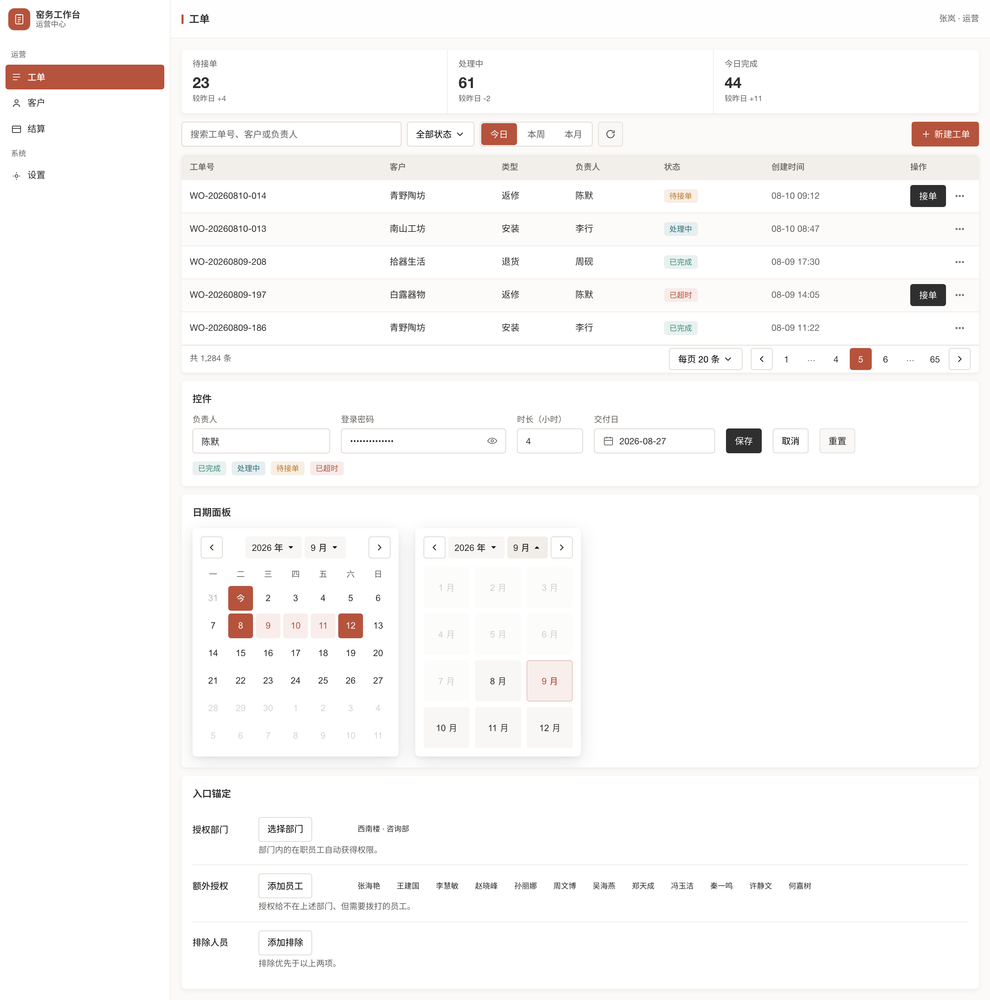
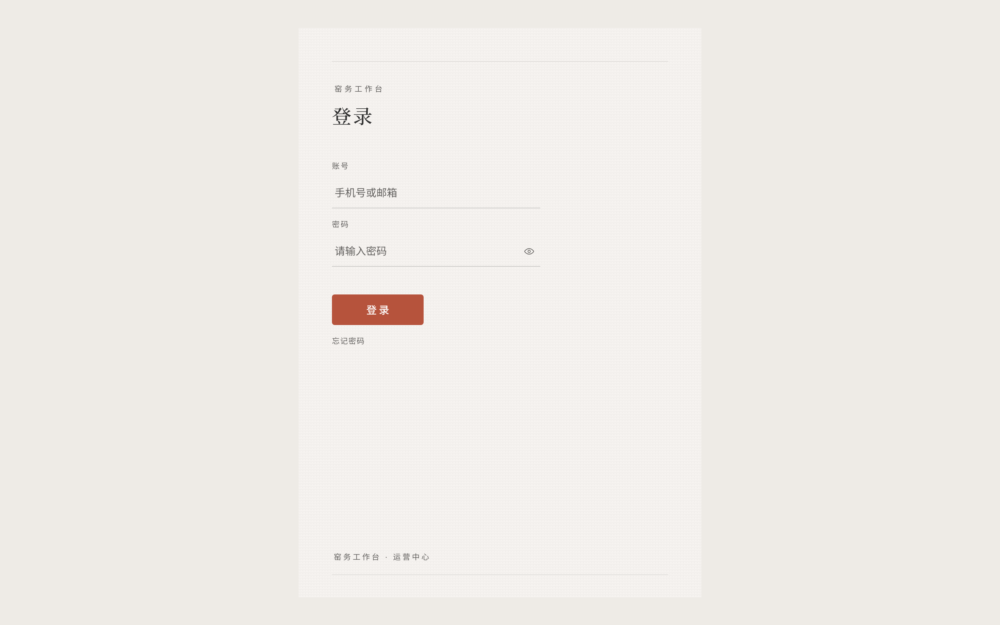

# kiln — 窑

[English](./README.md) · **简体中文**

陶土成器之所。中文后台工作台的设计系统——那些密集、不好看、但真正在干活的界面。

整个色彩体系都是窑里烧出的釉色：**陶土红**（clay，主色 / 关键动作 / 状态信号）、**窑青绿**（teal，成功）、**孔雀蓝**（peacock，信息）、**暖琥珀**（amber，警示）——暖、低饱和、做旧、彼此和谐。气质是一间**安静而密集的控制室**：信息价值第一，装饰最后。

不是营销页的设计系统。是干活的工具的设计系统。

---

## 两层，同一套釉色

**工作台层** —— 紧凑、暖黑阴影分层、信息密度第一。侧栏、指标条、工具栏、带冻结列的数据表、分页坞、表单控件、日期面板。



**纸面层** —— 同一套 token，换成大留白与印刷质感。用在登录、空状态、404、报告封面、发布说明、系统邮件这些**没人在干活**的表面上。



> 两张图由 `npm run screenshots` 从 `examples/*.html` 渲染，从不手截。同一批示范页也是渲染契约的断言目标，所以**图、规范、契约三者不会分家**。

---

## 这个仓库是什么

**它同时是三样东西**，这不是巧合，是刻意的：

| | |
|---|---|
| **数值的真相源** | `tokens/*.css` —— 消费方 `@import tokens/index.css` |
| **规则的真相源** | `SKILL.md` + `references/*.md` —— 人和 AI 读 |
| **一个 Claude Code skill** | 仓库根就是 skill 根 |

所以 **`git commit` 就是「改设计系统」**。没有额外的同步步骤，没有「记得也改一下那边」。

```
~/.claude/skills/kiln  ──symlink──>  这个仓库   （Claude Code）
~/.agents/skills/kiln  ──symlink──>  这个仓库   （Codex / Droid / opencode）
```

---

## 用法

### 让 AI 自己装

不用先读这份文档。在新项目里把下面**整段**发给 Claude Code / Codex / Droid：

```text
帮我接入 kiln 设计系统（中文后台 UI 设计规范），三步做完：

1. 若 ~/kiln 不存在，执行 git clone git@github.com:wensia/kiln.git ~/kiln
2. 建两个软链，缺一个对应 agent 就看不见它，而且不会报错：
   mkdir -p ~/.claude/skills ~/.agents/skills
   ln -s ~/kiln ~/.claude/skills/kiln
   ln -s ~/kiln ~/.agents/skills/kiln
3. 软链要重启会话才会进技能列表，所以本次会话直接读 ~/kiln/SKILL.md，
   按需读 ~/kiln/references/*.md。之后这个项目所有 UI 都以它为准。

如果这是 Tailwind v4 + shadcn 项目，再照 ~/kiln/ADOPTING.md 把 token
和两道校验门也接进来。
```

装好之后，每次开工只要一句：

> **先加载 kiln skill，之后所有 UI 都按它来。**

再把这句写进项目的 `CLAUDE.md` / `AGENTS.md`：技能没被自动触发时，规则还在。

**自检：问它「kiln 是什么」。** 答不上来就是软链没生效 —— 它不会报错，只会安然按通用审美把整个页面写完。

### 作为 token 源

```css
/* 你的 index.css */
@import "kiln/tokens/index.css";
```

或者把 `tokens/*.css` **整个文件**复制过去。**永远不要把数值重新敲进文档或代码片段**——那是在造第二个真相源。

要在真实代码库里落地，照 **[ADOPTING.md](./ADOPTING.md)** 走：那是从一次真实迁移（React + Vite + Tailwind v4 + shadcn，十几个页面、两万多行）反推出来的完整路径，含两个可直接复制的校验脚本，以及一张「哪些坑肉眼根本发现不了」的清单。

### 自检

```bash
npm run verify           # 静态：token 契约 + 规格表镜像 + 散文不含数值（零依赖）
npm run verify:examples  # 渲染：对 examples/workbench.html 跑运行时契约（需 playwright）
npm run verify:paper     # 版面：对 examples/paper-login.html 数真实像素（需 playwright）
npm run screenshots      # 重新生成 README 里的示例图（需 playwright）
```

---

## 数值只能住在一个地方

这套系统坏过一次，坏法值得写下来。

**画布色曾经同时有三套值**：readme 一套、`SKILL.md` 一套、`colors.css` 里是第三套。照散文实现的人只会得到一个错的颜色，而且只能靠肉眼发现。

**更阴险的是「部分给值」。** 规格表给了颜色的数值，却只给了阴影的名字和用途，于是实现者被迫**发明**阴影——而发明出来的值和查出来的值，在渲染之前长得一模一样。代价是六个阴影全错。

> **一张「部分给值、部分不给」的规格表，比完全不给值更危险。** 有值的地方你以为都能查到，没值的地方就开始发明。

所以规矩是三层：

| 层 | 能有数值吗 |
|---|---|
| `tokens/*.css` | **是** —— 机器真相源 |
| `references/tokens.md` | **是**，但它是 CSS 的**镜像**，由 `scripts/verify.mjs` 校验一致 |
| `SKILL.md`、本文件、其它散文 | **否** —— 只命名 token，解释为什么 |

`npm run verify` 会让违反的改动直接失败，pre-commit hook 会跑它。

> 网页版 Claude Design 的 design-system 项目是**可选的下游**：适合给非工程师看组件，但绝不是真相源。分发靠 git 和 npm。

---

## 散文管不住自己，所以有两道门

那次迁移里，**没有任何一个真 bug 是靠读代码发现的。**

**1. token 契约（构建时）** —— 契约里的 token 全部有定义、没人自造、业务代码里没有裸 hex、没有 Tailwind 调色板裸色（`bg-green-100`）、没有出厂阴影（`shadow-sm` 那一批是冷调黑）、没有页面专属的写死像素高度。

**2. 渲染样式契约（运行时）** —— 驱动真实页面，断言浏览器**算出来**的样式：圆角阶梯、控件高度、每视口至多一个陶土红动作、白卡靠阴影而非边框分层、阴影一律暖黑、字体栈、字号的上下限、表格只有横向分隔线。

**第二道门是唯一能抓住组合错误的东西。** 一个半透明的表面是**上下文相关**的：把它从设计时所在的画布挪进白卡，对比度会无声失效——而 token 和类名看起来全都还是对的。

覆盖**每一个**页面、每一个 tab。**一条从不执行的断言比没有断言更坏**——它让人以为这里有保护。

---

## 结构

```
kiln/
├── SKILL.md                    # skill 入口：请求路由、意图、工艺规则、反模式
├── references/
│   ├── tokens.md               # 规格表（CSS 的镜像，机器校验一致）
│   ├── components.md           # 组件规格、状态、QA
│   ├── layouts-and-pages.md    # shell、侧栏（含折叠 rail）、DataTableDock、页面蓝图
│   ├── platform-mapping.md     # React/Tailwind、纯 CSS、暗色、小程序、跨项目复用
│   └── paper.md                # ★ 纸面层：登录 / 空状态 / 404 / 封面 / 发布说明 / 邮件
├── tokens/                     # ★ 数值的唯一真相源
│   ├── index.css               #   工作台入口，消费方只 import 这个
│   ├── colors.css  typography.css  spacing.css
│   ├── radius.css  elevation.css   fonts.css  base.css
│   └── paper.css               #   纸面层：**不**被 index.css 引入，纸面页面显式加载
├── contract/tokens.json        # 合法 token 全集（工作台层与纸面层分开列）
├── evals/evals.json            # skill 冒烟测试
├── examples/
│   ├── workbench.html          #   工作台示范页：渲染契约的自测目标，也是 README 图的来源
│   └── paper-login.html        #   纸面层示范页：版面契约的自测目标
├── docs/                       # README 的示例图（由 npm run screenshots 生成，勿手改）
└── scripts/
    ├── verify.mjs              # 静态自检：契约 + 镜像一致 + 散文不含数值
    ├── verify-examples.mjs     # 工作台：结构断言（computed style）
    ├── verify-paper.mjs        # 纸面层：版面断言（逐像素数墨占比与色相簇）
    ├── screenshots.mjs         # 从示范页渲染 README 示例图（图不手截，避免第二个真相源）
    ├── lib/runtime-contract.mjs # ★ 渲染断言的唯一来源（示范页与宿主模板共用）
    └── templates/              # 宿主项目模板：只写「跑哪些页面」，规则从 lib 来
```
